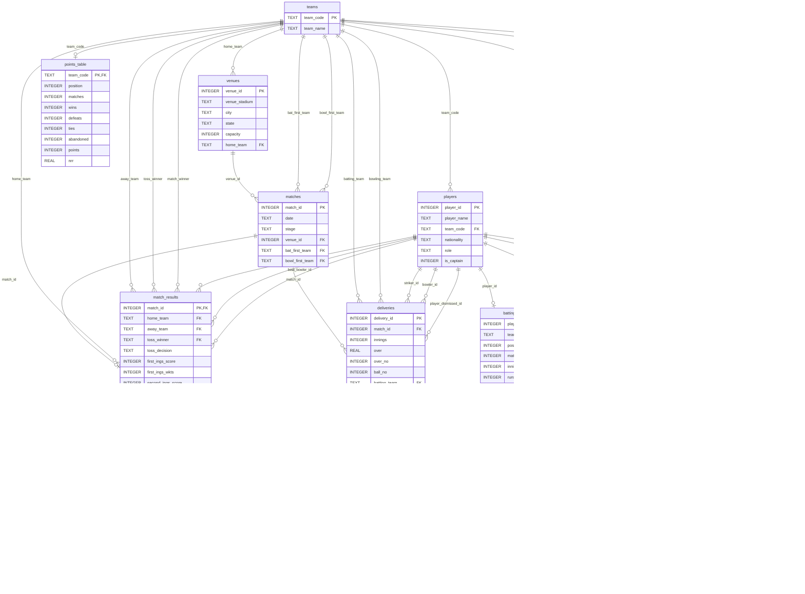

# IPL 2026 relational schema

```mermaid
erDiagram
    teams ||--o{ venues : "home_team"
    teams ||--o{ players : "team_code"
    teams ||--o{ matches : "bowl_first_team"
    teams ||--o{ matches : "bat_first_team"
    venues ||--o{ matches : "venue_id"
    players ||--o{ match_results : "best_bowler_id"
    players ||--o{ match_results : "top_scorer_id"
    players ||--o{ match_results : "player_of_the_match_id"
    teams ||--o{ match_results : "match_winner"
    teams ||--o{ match_results : "toss_winner"
    teams ||--o{ match_results : "away_team"
    teams ||--o{ match_results : "home_team"
    matches ||--o| match_results : "match_id"
    players ||--o{ deliveries : "player_dismissed_id"
    players ||--o{ deliveries : "bowler_id"
    players ||--o{ deliveries : "striker_id"
    teams ||--o{ deliveries : "bowling_team"
    teams ||--o{ deliveries : "batting_team"
    matches ||--o{ deliveries : "match_id"
    players ||--o{ delivery_fielders : "player_id"
    deliveries ||--o{ delivery_fielders : "delivery_id"
    teams ||--o{ batting_stats : "team_code"
    players ||--o| batting_stats : "player_id"
    teams ||--o{ bowling_stats : "team_code"
    players ||--o| bowling_stats : "player_id"
    teams ||--o{ fielding_stats : "team_code"
    players ||--o| fielding_stats : "player_id"
    teams ||--o| points_table : "team_code"
    teams {
        TEXT team_code PK
        TEXT team_name
    }
    venues {
        INTEGER venue_id PK
        TEXT venue_stadium
        TEXT city
        TEXT state
        INTEGER capacity
        TEXT home_team FK
    }
    players {
        INTEGER player_id PK
        TEXT player_name
        TEXT team_code FK
        TEXT nationality
        TEXT role
        INTEGER is_captain
    }
    matches {
        INTEGER match_id PK
        TEXT date
        TEXT stage
        INTEGER venue_id FK
        TEXT bat_first_team FK
        TEXT bowl_first_team FK
    }
    match_results {
        INTEGER match_id PK,FK
        TEXT home_team FK
        TEXT away_team FK
        TEXT toss_winner FK
        TEXT toss_decision
        INTEGER first_ings_score
        INTEGER first_ings_wkts
        INTEGER second_ings_score
        INTEGER second_ings_wkts
        TEXT match_result
        TEXT match_winner FK
        INTEGER wb_runs
        INTEGER wb_wickets
        INTEGER balls_left
        INTEGER player_of_the_match_id FK
        INTEGER top_scorer_id FK
        INTEGER highscore
        INTEGER best_bowler_id FK
        TEXT best_bowling_figure
        TEXT super_over_match
    }
    deliveries {
        INTEGER delivery_id PK
        INTEGER match_id FK
        INTEGER innings
        REAL over
        INTEGER over_no
        INTEGER ball_no
        TEXT batting_team FK
        TEXT bowling_team FK
        INTEGER striker_id FK
        INTEGER bowler_id FK
        INTEGER runs_of_bat
        INTEGER extras
        INTEGER wide
        INTEGER legbyes
        INTEGER byes
        INTEGER noballs
        TEXT wicket_type
        INTEGER player_dismissed_id FK
    }
    delivery_fielders {
        INTEGER delivery_id PK,FK
        INTEGER player_id PK,FK
        INTEGER is_substitute
    }
    batting_stats {
        INTEGER player_id PK,FK
        TEXT team_code FK
        INTEGER position
        INTEGER matches
        INTEGER innings
        INTEGER runs
        REAL impact
        REAL average
        REAL strike_rate
        INTEGER not_outs
        INTEGER high_score
        INTEGER balls_faced
        INTEGER hundreds
        INTEGER fifties
        INTEGER ducks
        INTEGER fours
        INTEGER sixes
    }
    bowling_stats {
        INTEGER player_id PK,FK
        TEXT team_code FK
        INTEGER position
        INTEGER matches
        INTEGER innings
        INTEGER wickets
        REAL economy
        REAL impact
        TEXT bbi
        REAL overs
        INTEGER balls
        INTEGER dot_balls
        INTEGER maiden_overs
        INTEGER runs
        REAL avg
        INTEGER c_4wh
        INTEGER c_5wh
    }
    fielding_stats {
        INTEGER player_id PK,FK
        TEXT team_code FK
        INTEGER rank
        INTEGER matches
        INTEGER catches
        REAL cpm
    }
    points_table {
        TEXT team_code PK,FK
        INTEGER position
        INTEGER matches
        INTEGER wins
        INTEGER defeats
        INTEGER ties
        INTEGER abandoned
        INTEGER points
        REAL nrr
    }
```
